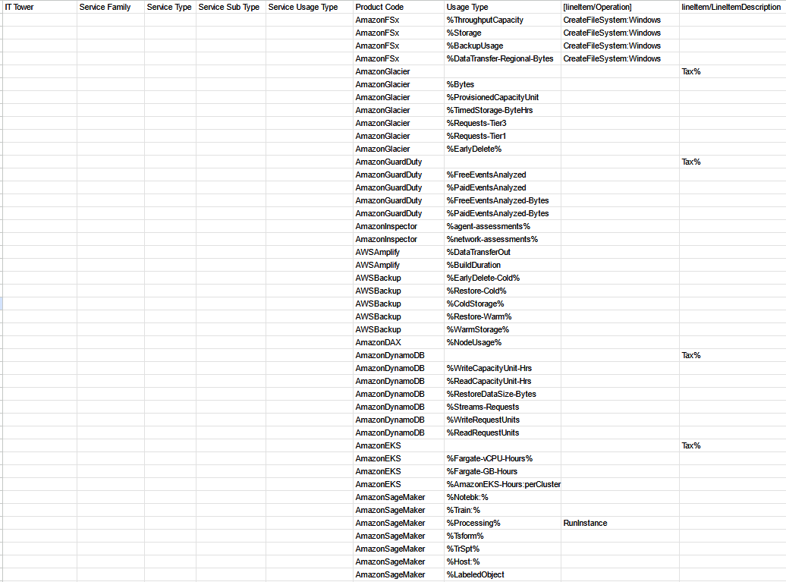
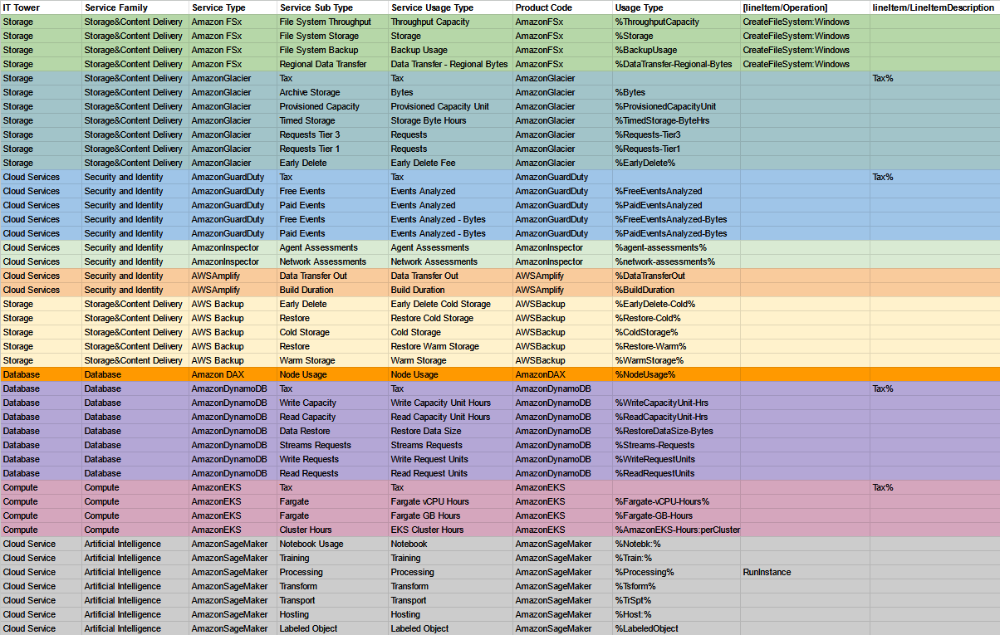

# Лабораторная работа 1. Знакомство с IaaS, PaaS, SaaS сервисами в облаке на примере Amazon Web Services (AWS). Создание сервисной модели.

---

## Введение

### Цель работы: 
Знакомство с облачными сервисами. Понимание уровней абстракции над инфраструктурой в облаке. Формирование понимания типов потребления сервисов в сервисной-модели. 

### Дано: 
1. Слепок данных биллинга от провайдера после небольшой обработки в виде SQL-параметров. Символ % в начале/конце означает, что перед/после него может стоять любой набор символов.
2. Образец итогового соответствия, что желательно получить в конце. В этом же документе.

### Необходимо: 
1. Импортировать файл .csv в Excel или любую другую программу работы с таблицами. Для Excel делается на вкладке Данные – Из текстового / csv файла – выбрать файл, разделитель – точка с запятой.
2. Распределить потребление сервисов по иерархии, чтобы можно было провести анализ от большего к меньшему (напр. От всех вычислительных ресурсов Compute дойти до конкретного типа использования - Выделенной стойка в датацентре Dedicated host usage).
3. Сохранить файл и залить в соответствующую папку на Google Drive.

### Алгоритм работы: 
Сопоставить входящие данные от провайдера с его же документацией. Написать в соответствие колонкам справа значения 5 колонок слева, которые бы однозначно классифицировали тип сервиса. Для столбцов IT Tower и Service Family значения можно выбрать из образца.

---

## Практическая часть

Изначально дан следующий слепок данных биллинга team 8 (вариант 8):

Теперь распределим сервисы по иерархии для анализа:

Описание используемых сервисов:

| Сервис | Описание |
|-------------|-------------|
|  Amazon FSx   |   Сервис для упрощенного развертывания и управления высокопроизводительными файловыми системами в облаке AWS  |
|  Amazon Glacier   |  Хранилище, которое является достаточно экономичным решением, для архивирования данных с низкой частотой доступа, актуально для долгосрочного хранения  данных |
|   Amazon GuardDuty  |   Сервис для обнаружения угроз. Непрерывный мониторинг  |
|  Amazon Inspector   |  Тестирование на наличие уязвимостей и соответствия стандартам безопасности    |
|  AWS Amplify   | Инструмент для быстрого создания и развертывания веб-приложений и/или мобильных приложений. Есть возможность работы по API    |
|   AWS Backup  |  Централизованный сервис для автоматического создания резервных копий и восстановления данных. Соответствие стандартам безопаности (сохранности) данных в различных сервисах AWS   |
|   Amazon DAX  |  Ускоритель кэширования для Amazon DynamoDB   |
|   Amazon DynamoDB  | NoSQL БД, предназначенная для работы с большими объемами данных, обеспечивающая низкие задержки  |
|  Amazon EKS   |   Сервис для запуска контейнеров Kubernetes, развертывание контейнеров в AWS  |
|  Amazon SageMaker  |  Сервис для обучения (дообучения), развертывания и управления моделями ML. Упрощенная интеграция AI/ML в приложения|

## Вывод

При выполнении лабораторной работы №1 я ознакомился с сервисами AWS - их особенности и применение. Изучил абстракции над инфраструктурой в облаке и распределил сервисы по иерархии.

