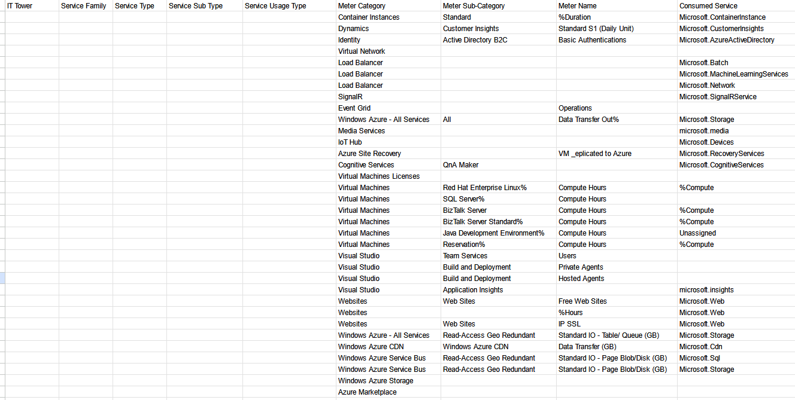
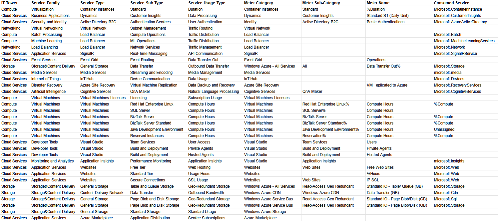

# Лабораторная работа 2. Сравнение сервисов Amazon Web Services и Microsoft Azure. Создание единой кросс-провайдерной сервисной модели.

---

## Введение

### Цель работы: 
Получение навыков аналитики и понимания спектра публичных облачных сервисов без привязки к вендору. Формирование у студентов комплексного видения Облака. 

### Дано: 
1. Данные лабораторной работы 1.
2. Слепок данных биллинга от провайдера после небольшой обработки в виде SQL-параметров. Символ % в начале/конце означает, что перед/после него может стоять любой набор символов.
3. Образец итогового соответствия, что желательно получить в конце. В этом же документе  

### Необходимо: 
1. Импортировать файл .csv в Excel или любую другую программу работы с таблицами. Для Excel делается на вкладке Данные – Из текстового / csv файла – выбрать файл, разделитель – точка с запятой.
2. Распределить потребление сервисов по иерархии, чтобы можно было провести анализ от большего к меньшему (напр. От всех вычислительных ресурсов Compute дойти до конкретного типа использования - Выделенной стойка в датацентре Dedicated host usage). При этом сохранять логическую концепцию, выработанную в Лабораторной работе 1.
3. Сохранить файл и залить в соответствующую папку на Google Drive.

### Алгоритм работы: 
Сопоставить входящие данные от провайдера с его же документацией. Написать в соответствие колонкам справа значения 5 колонок слева, которые бы однозначно классифицировали тип сервиса. Для столбцов IT Tower и Service Family значения можно выбрать из образца. В ходе выполнения работы не отходить от принципов классификации, выбранных в Лабораторной работе 1. Например, если сервис Машинного обучения был разбит на Вычислительные мощности и Облачные сервисы, то продолжать его разбивать и в новых данных.

---

## Практическая часть

Изначально дан следующий слепок данных биллинга team 8 (вариант 8):

Распределим сервисы по иерархии:

Описание используемых сервисов:

| Сервис | Описание |
|-------------|-------------|
|  Container Instances   |   Сервис для развертывания контейнеров без управления виртуальными машинами |
|  Dynamics   |   Платформа для анализа данных о клиентах и автоматизации бизнес-процессов, таких как CRM и ERP  |
|  Active Directory B2C   |  Сервис управления аутентификацией и авторизацией пользователей   |
|   Virtual Network  |  Сервис для создания изолированных сетевых инфраструктур в облаке, позволяющий управлять подсетями и соединениями   |
|   Load Balancer  |  Сервис для распределения сетевого трафика между несколькими ресурсами для повышения доступности и отказоустойчивости   |
|   SignalR  |  Платформа для создания приложений для работы в реальном времени (трансляции)   |
|  Event Grid   |  Сервис для управления событиями и сообщениями между различными сервисами и приложениями   |
|   Media Services  |  Инструмент для обработки мультимедиа - потоковая передача, кодирование видео, управление медиа   |
|  IoT Hub  |   Платформа для подключения, мониторинга и управления IoT-устройствами  |
|  Azure Site Recovery  |  Сервис для создания резервных копий и восстановления инфраструктуры в случае сбоев  |
| Cognitive Services   |   Сет API для интеграции AI  |
|  Virtual Machines  |  Услуга предоставления виртуальных серверов для размещения приложений. Есть возможность выбора операционных систем и кастомизация   |
| Visual Studio   |  Редактор кода, IDE   |
| Application Insights   |  Сервис мониторинга производительности приложений и анализа данных для диагностики и оптимизации   |
| Websites   |   Платформа для развертывания и управления веб-сайтами |
| General Storage   | Услуга хранения данных, включая BLOB-объекты, очереди и таблицы    |
| Content Delivery Network   |  Сеть доставки контента для ускорения передачи данных и минимизации задержек за счёт использования географически распределённых серверов   |
| Azure Marketplace   |   Платформа для покупки и распространения приложений, инфраструктуры и услуг, созданных сторонними разработчиками (маркетплейс приложений)  |

## Вывод

При выполнении лабораторной работы №2 я ознакомился с сервисами и структурой Microsoft Azure. По аналогии с лр №2 по AWS, сделал распределение сервисов по иерархии.