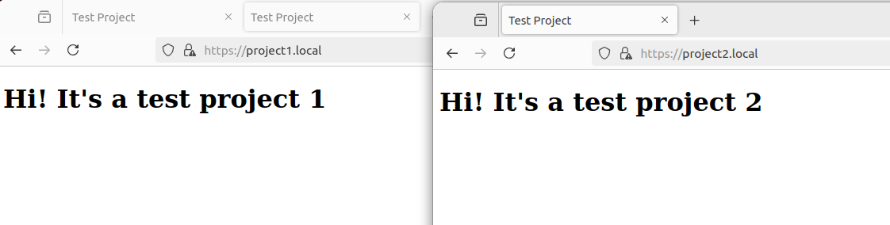

# Лабораторная работа № 1 - NGINX

---

## Введение

В рамках лабораторной работы необходимо было настроить nginx по следующим требованиям:
- Должен работать по https c сертификатом;
- Настроить принудительное перенаправление HTTP-запросов (порт 80) на HTTPS (порт 443) для обеспечения безопасного соединения;
- Использовать alias для создания псевдонимов путей к файлам или каталогам на сервере;
- Настроить виртуальные хосты для обслуживания нескольких доменных имен на одном сервере.

## Практическая часть

### Установка nginx

Установка:

```
sudo apt update
sudo apt install nginx
sudo systemctl enable nginx
```
После установки запускаем nginx и проверяем статус:

```
sudo systemctl start nginx
sudo systemctl status nginx
```


Nginx зустановлен и запущен

### Приложения
Создадим два простых приложения

Разместим два проекта в ```/var/www/```:
```/var/www/project1/index.html``` и ```/var/www/project2/index.html```

index.html 1го приложения:
```<!DOCTYPE html>

<html lang="en">

<head>

    <meta charset="UTF-8">

    <meta name="viewport" content="width=device-width, initial-scale=1.0">

    <title>Test Project</title>

</head>

<body>

    <h1>Hi! It's a test project 1</h1>

</body>

</html>
```

Для второго приложения код аналогичный, отличие лишь в ```It's a test project 2```

### Настройка

В ```/etc/hosts``` добавляем конфигурацию для project1 и project2:

```
127.0.0.1 project1.local
127.0.0.1 project2.local
```

Настроим переадресацию с HTTP на HTTPS и подгрузим SSL.
Так как я выполняю все локально, использовать Certbot для получения SSL сертификата не получится. В таком случае получим сертификат с ручным введением всех данных:
```
sudo openssl req -x509 -nodes -days 365 -newkey rsa:2048 -keyout /etc/ssl/localcerts/project1.key -out /etc/ssl/localcerts/project1.crt
```

```
sudo openssl req -x509 -nodes -days 365 -newkey rsa:2048 -keyout /etc/ssl/localcerts/project2.key -out /etc/ssl/localcerts/project2.crt
```

После прописания команды необходимо будет прописать регион, город, организацию, проект и почту.

В ```/etc/nginx/nginx.conf``` пропишем все конфигурации для каждого проекта:
- Переадресация
- Использование SSL
- Alias

```
events {}

http {
    include /etc/nginx/mime.types;
    default_type application/octet-stream;

    server {
        listen 80;
        server_name project1.local;

        return 301 https://$host$request_uri;
    }

    server {
        listen 443 ssl;
        server_name project1.local;

        ssl_certificate /etc/ssl/certs/project1.crt;
        ssl_certificate_key /etc/ssl/private/project1.key;

        location / {
            alias /var/www/project1/;
            index index.html;
            try_files $uri $uri/ =404;
        }
    }

    server {
        listen 80;
        server_name project2.local;

        return 301 https://$host$request_uri;
    }

    server {
        listen 443 ssl;
        server_name project2.local;

        ssl_certificate /etc/ssl/certs/project2.crt;
        ssl_certificate_key /etc/ssl/private/project2.key;

        location / {
            alias /var/www/project2/;
            index index.html;
            try_files $uri $uri/ =404;
        }
    }
}
```

После чего проверим ошибки:
```sudo nginx -t```

При отсутствии ошибок можно получить следующий текст:
```
nginx: the configuration file /etc/nginx/nginx.conf syntax is ok
nginx: configuration file /etc/nginx/nginx.conf test is successful

```

Перезапускаем nginx:
```sudo systemctl restart nginx```

### Проверка

При переходе на ```http://project1.local``` происходит переадресация на https и появляется текст "Hi! It's a test project 1", значит все выполнено правильно. Аналогично и со вторым приложением.

