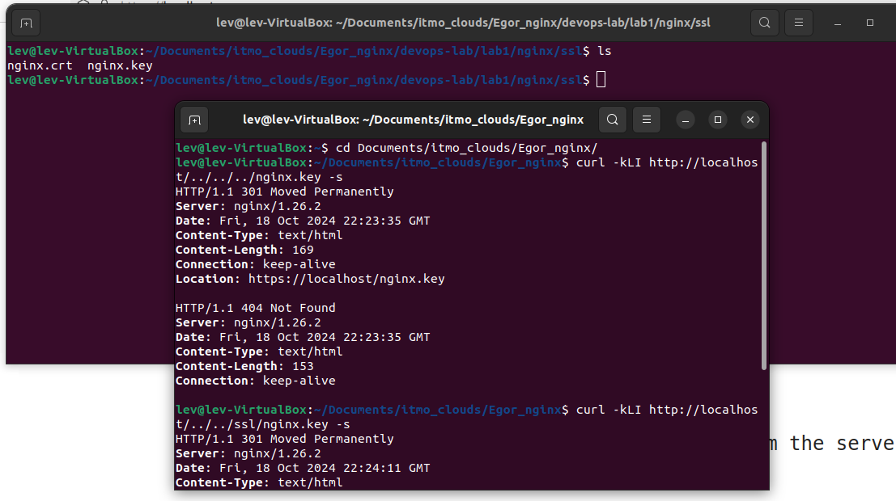
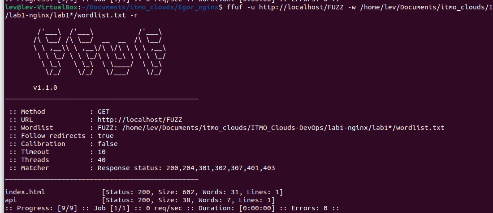
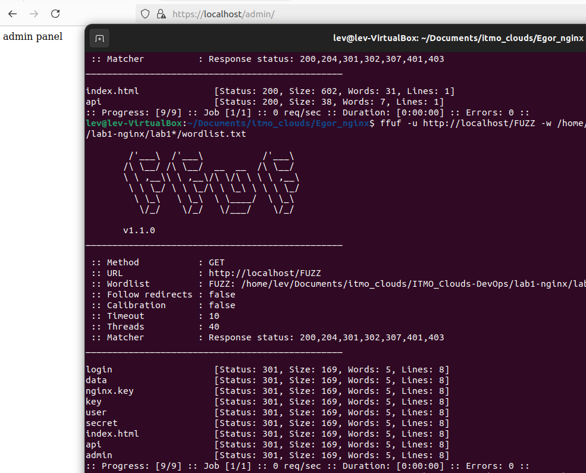
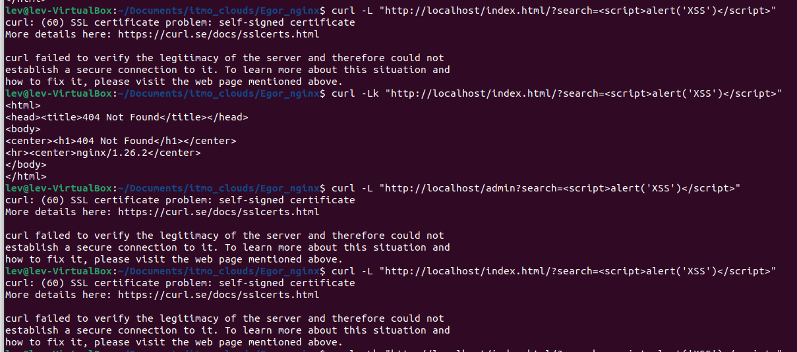

# Лабораторная работа № 1* - Взлом Nginx
---

## Введение


В рамках лабораторной работы необходимо:

Попробовать взломать nginx другой команды. Проверить минимум три уязвимости - например path traversal, перебор страниц через ffuf и/или любые другие на ваш выбор.
Взлом считается успешным, если вы попали туда, куда не планировалось попадать пользователю, даже если там ничего нет. Успешность взлома не влияет на оценку лаб обеих команд. 
В отчет приложить скрины попыток взлома, описание уязвимостей, на которые проверяли и итог - успешен взлом или нет.
Тк открывать такие нжинксы в интернет не лучшая идея, для решения лабы предлагаю либо встретиться с другой командой в одном помещении и поднять локальную сеть, либо запустить у себя нжинкс с их конфигом. Но при этом настройки нжинкс со стороны админа и изменения в конфиге считаться попыткой взлома не будут.
Просьба договориться с другими командами кто кого ломает. Взлом нжинкса одной команды не должен фигурировать в отчетах больше двух раз.


---

## Практическая часть

Для тестирования я взял работу https://github.com/EgorLaptev/devops-lab/tree/master/lab1/nginx

Благо Егор обернул проект в докер, проблем с развертыванием не было, за это ему спасибо.

1. Path traversal

Посмотрев проект, я заметил, что в нем есть nginx.key



Но получить ключ не получилось, возвращалась ошибка 404.

2. Ffuf

С помощью ffuf я искал скрытые файлы и директории, предварительно создав словарь wordlist, в которой записал варианты для поиска:

```
admin
key
index.html
nginx.key
secret
login
user
data
api
```




Я смог найти скрытый раздел admin

3. Cross-Site Scripting (XSS)

Третьим этапов я попробовл пробраться непосредственно на страницу и внедрить туда скрипт



Но, за счет того, что в проекте используется ssl - сертификат, сделать у меня это не получилось.

Таким образом, у меня получилось найти 1 скрытый раздел с помощью ffuf.