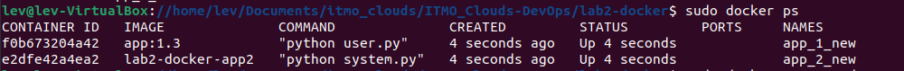

# Лабораторная работа № 2* - Docker compose

---

## Введение


В рамках лабораторной работы необходимо:

1. Написать “плохой” Docker compose файл, в котором есть не менее трех “bad practices” по их написанию.
2. Написать “хороший” Docker compose файл, в котором эти плохие практики исправлены.
3. В Readme описать каждую из плохих практик в плохом файле, почему она плохая и как в хорошем она была исправлена, как исправление повлияло на результат.
4. После предыдущих пунктов в хорошем файле настроить сервисы так, чтобы контейнеры в рамках этого compose-проекта так же поднимались вместе, но не "видели" друг друга по сети. В отчете описать, как этого добились и кратко объяснить принцип такой изоляции.

---

## Практическая часть

Пусть у нас есть 2 приложения
"Плохой" Docker compose:

```
version: '3.8'

services:

  app1:
    image: app:latest
    container_name: app_1_new
    networks:
      - app_network
    environment:
      - API_KEY='KEY'

  app2:
    build:
      context: ./app_system
      dockerfile: Dockerfile

    container_name: app_2_new
    networks:
      - app_network
    environment:
      - API_KEY='key'

networks:
  app_network:
    driver: bridge
```

Проверим, что контейнеры запускаются и работают:


Плохие практики:

1. Использование latest тега: ```image: app:latest``` - неопределенная версия образа. Могут возникнуть несовместимости при каких-либо обновлениях в проекте. Также усложняется отладка, поскольку определить конкретную версию образа становится трудно.
2. Хранение конфиденциальных данных: ```API_KEY='KEY'``` - в первую очередь это безопасность. При публикации проекта все конфиденциальные данные будут в сети. Кроме того это усложняет работу над проектом, поскольку при появлении новых ключей необходимо будет вносить изменения в docker compose, а не просто обновить окружение.
3. Отсутствие ограничений на память. Без ограничений контейнеры могут использовать всю память системы, что приведет к падению производительности, а может быть и до отказа всей системы системы.

Исправим ошибки:

```
version: '3.8'

services:

  app1:
    image: app:1.3
    container_name: app_1_new
    networks:
      - app_network
    environment:
      - API_KEY=${API_KEY}
    deploy:
      resources:
        limits:
          memory: 32M

  app2:
    build:
      context: ./app_system
      dockerfile: Dockerfile

    container_name: app_2_new
    networks:
      - app_network
    environment:
      - API_KEY=${API_KEY}
    deploy:
      resources:
        limits:
          memory: 64M

networks:
  app_network:
    driver: bridge
```

1. Теперь тег определен: ```app:1.3```. Я переименовал существующий образ ```docker tag app:latest app:1.3``` и версию с тегом latest удалил, так как она не нужна (для дальнейших изменений можно копировать действующий образ и также его переименовывать).
2. API ключ теперь берется из .env окружения, а не хранится прямо в docker compose.
3. Добавлены ограничения на память:
```
deploy:
      resources:
        limits:
          memory: 64M
```
Проверим ограничения:
```docker stats```





На данный момент оба контейнера подключены к одной сети:
```
networks:
  app_network:
    driver: bridge
```

Для того, чтобы контейнеры не видели друг друга, подключим их к разным сетям:
```
networks:
  app1_network:
    driver: bridge
  app2_network:
    driver: bridge
```


После изменений и запуска контейнеров, проверим, можно ли вызвать из второго контейнера первый:

```sudo docker exec -it app_2_new sh```

Результат:


Значит контейнеры не видят друг друга, так как находятся в разных сетях. 

Итоговый docker-compose:

```
version: '3.8'

services:

  app1:
    image: app:1.3
    container_name: app_1_new
    networks:
      - app1_network
    environment:
      - API_KEY=${API_KEY}
    deploy:
      resources:
        limits:
          memory: 32M

  app2:
    build:
      context: ./app_system
      dockerfile: Dockerfile
    container_name: app_2_new
    networks:
      - app2_network
    environment:
      - API_KEY=${API_KEY}
    deploy:
      resources:
        limits:
          memory: 64M

networks:
  app1_network:
    driver: bridge
  app2_network:
    driver: bridge
```

Таким образом я узнал несколько плохих практик по работе с docker-compose и как их правильно исправлять. Написал несколько docker-compose файлов и настроил контейнеры так, чтобы они не видели друг друга. 