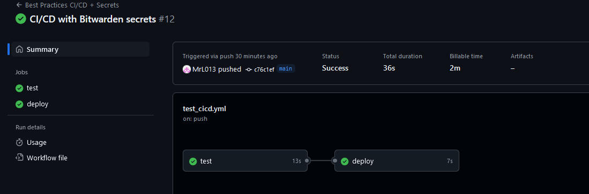
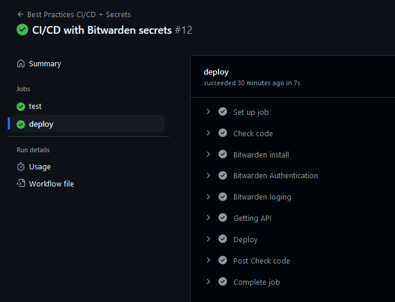

# Лабораторная работа № 3 - CI/CD

---

## Введение


В рамках лабораторной работы необходимо:

Сделать красиво работу с секретами. Например, поднять Hashicorp Vault (или другую секретохранилку) и сделать так, чтобы ci/cd пайплайн (или любой другой ваш сервис) ходил туда, брал секрет, использовал его не светя в логах. В Readme аргументировать почему ваш способ красивый, а также описать, почему хранение секретов в CI/CD переменных репозитория не является хорошей практикой.


---

## Практическая часть

За основу возьму пайплан из третьей лабораторной работы - https://github.com/MrL013/ITMO_Clouds-DevOps/tree/main/lab3-ci-cd - и добавлю к нему сервис Bitwarden (https://bitwarden.com/)

Ранее я хранил секрет (API_KEY) в GH Secrets, теперь буду хранить в стороннем сервисе. 

Для этого в GH Secrets добавлю данные для авторизации в Bitwarden:
- BW_CLIENTID
- BW_CLIENTSECRET
- BW_MASTER_PASSWORD

Установим Bitwarden Cli:

```yml
- name: Bitwarden install
        run: |
          curl -L https://github.com/bitwarden/cli/releases/download/v1.20.0/bw-linux-1.20.0.zip -o bw-cli.zip
          unzip bw-cli.zip
          sudo mv bw /usr/local/bin/
          sudo chmod +x /usr/local/bin/bw
```

После этого авторизуемся:

```yml
- name: Bitwarden Authentication
        env:
          BW_CLIENTID: ${{ secrets.BW_CLIENTID }}
          BW_CLIENTSECRET: ${{ secrets.BW_CLIENTSECRET }}
          BW_MASTER_PASSWORD: ${{ secrets.BW_MASTER_PASSWORD }}
        run: |
          bw login --apikey --quiet
          export BW_SESSION=$(bw unlock --raw $BW_MASTER_PASSWORD)
```

И теперь необходимо взять секрет:

```yml
- name: Getting API
        env:
          BW_SESSION: ${{ env.BW_SESSION }}
        run: |
          export API_KEY=$(bw get item "API_KEY" | jq -r '.login.password' 2>/dev/null)
```

Для того, чтобы избежать логирования, я добавил флаг ```--quiet``` и перенаправил вывод, если будут ошибки при экспорте секрета - ```2>/dev/null```.

Итоговая версия:

```yml
name: Best Practices CI/CD + Secrets

on:
  push:
    branches:
      - main

jobs:
  test:
    runs-on: ubuntu-22.04

    steps:
      - name: Check code
        uses: actions/checkout@v3

      - name: Setup Python
        uses: actions/setup-python@v4
        with:
          python-version: "3.9"

      - name: Cache dependencies
        uses: actions/cache@v3
        with:
          path: ~/.cache/pip
          key: ${{ runner.os }}-pip-${{ hashFiles('**/requirements.txt') }}
          restore-keys: |
            ${{ runner.os }}-pip-

      - name: Install dependencies
        run: pip install -r requirements.txt

      - name: Run tests
        run: pytest

  deploy:
    runs-on: ubuntu-22.04
    needs: test

    steps:
      - name: Check code
        uses: actions/checkout@v3

      - name: Bitwarden install
        run: |
          curl -L https://github.com/bitwarden/cli/releases/download/v1.20.0/bw-linux-1.20.0.zip -o bw-cli.zip
          unzip bw-cli.zip
          sudo mv bw /usr/local/bin/
          sudo chmod +x /usr/local/bin/bw

      - name: Bitwarden Authentication
        env:
          BW_CLIENTID: ${{ secrets.BW_CLIENTID }}
          BW_CLIENTSECRET: ${{ secrets.BW_CLIENTSECRET }}
          BW_MASTER_PASSWORD: ${{ secrets.BW_MASTER_PASSWORD }}
        run: |
          bw login --apikey --quiet
          export BW_SESSION=$(bw unlock --raw $BW_MASTER_PASSWORD)

      - name: Getting API
        env:
          BW_SESSION: ${{ env.BW_SESSION }}
        run: |
          export API_KEY=$(bw get item "API_KEY" | jq -r '.login.password' 2>/dev/null)

      - name: Deploy
        env:
          API_KEY: ${{ env.API_KEY }}
        run: |
          ./deploy.sh
```





## Вывод
Говоря про целесообразность данного метода, я бы отметил несколько аргументов за использование внешних хранилищ:
- Гибкость. В Bitwarden можно быстро и удобно добавлять/удалять/изменять секреты, в то время как в GH Actions этот процесс будет более длительным.
- Безопасность. Сложно сказать, на сколько этот метод будет безопаснее, но при отсутствии логирования секреты будут невидимы при развертывании проекта, а значит это балл в пользу безопасности. К тому же, если секрет попадет в коммит (при хранении секретов в GH Actions), то это будет утечка, а значит проблема безопасности. 
