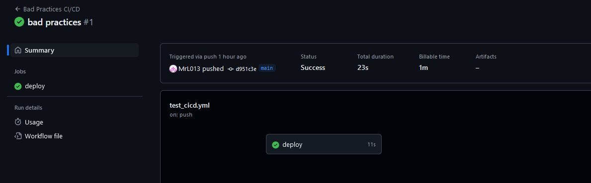
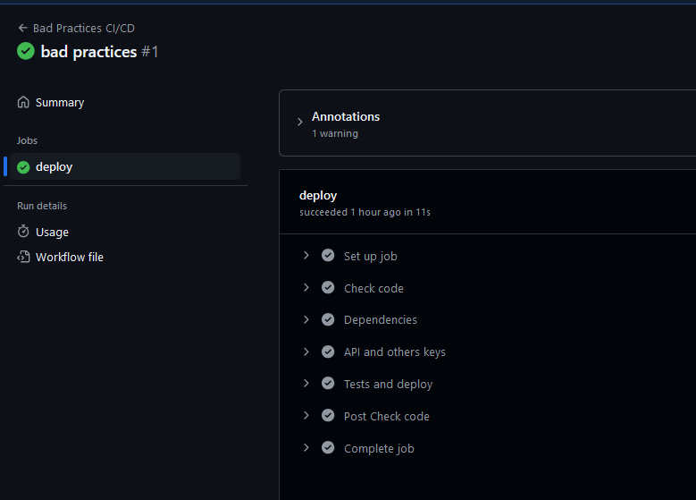
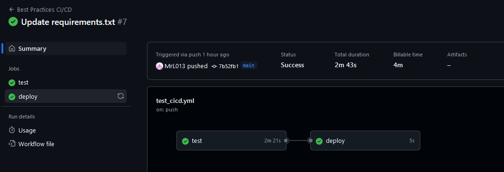
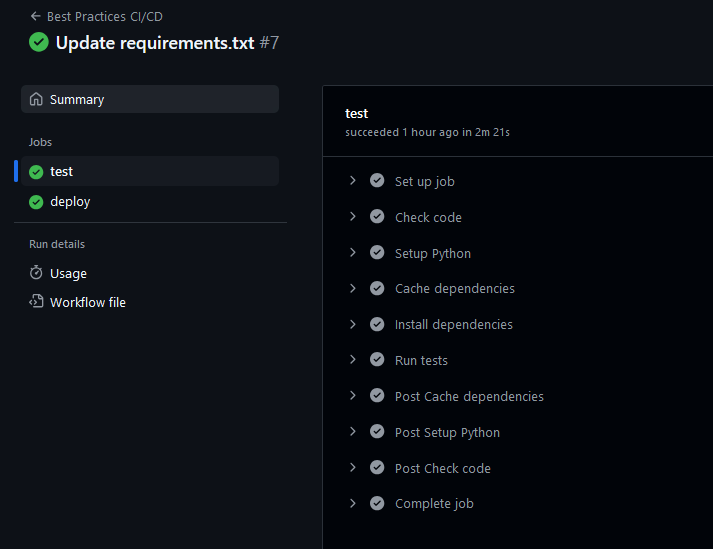
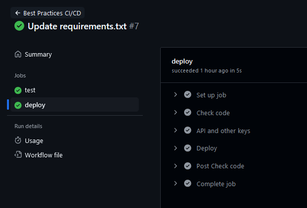

# Лабораторная работа № 3 - CI/CD

---

## Введение


В рамках лабораторной работы необходимо:

1. Написать “плохой” CI/CD файл, который работает, но в нем есть не менее пяти “bad practices” по написанию CI/CD.
2. Написать “хороший” CI/CD, в котором эти плохие практики исправлены.
3. В Readme описать каждую из плохих практик в плохом файле, почему она плохая и как в хорошем она была исправлена, как исправление повлияло на результат
4. Прочитать историю про Васю (она быстрая, забавная и того стоит): https://habr.com/ru/articles/689234.

---

## Практическая часть

Пусть у нас будет простое python приложение, напишем для него ci/cd с 5 плохими практиками и исправим их:

#### "Плохой" CI/CD
```yaml
name: Bad Practices CI/CD

on:
  push

jobs:
  deploy:
    runs-on: ubuntu-latest

    steps:
      - name: Check code
        uses: actions/checkout@v3

      - name: Dependencies
        run: pip install -r requirements.txt

      - name: API and others keys
        env:
          API_KEY: "key ****"
        run: echo "API Key - $API_KEY"

      - name: Tests and deploy
        run: |
          pytest || echo "Error test"
          echo "Deploying"
          ./deploy.sh
```

##### Результат работы:




##### Ошибки:

1. CI/CD будет выполняться после каждого пуша независимо от ветки. В командной (и личной) работе, где ведется работа в разных ветках это приведет к регулярному запуску даже там, где в этом нет смысла (увеличивается время сборки):

```yaml
on:
  push
```

2. ```ubuntu-latest``` - использование latest тега. Как и при работе с докером, это приведет к конфликтам в версиях фреймворков и библиотек. Иронично, но именно в этой работе я с этим столкнулся (об этом позже).
  
3. Установка зависимостей без кэширования. Каждый раз будет тратиться время на установку одних и тех же пакетов, которые были установлены раньше.

4. Хранение конфиденциальных данных (ключей) в открытом доступе - ```API_KEY: "key ****"```. Снова, как и в докере, это вопрос безопасности и неуниверсальности при работе. При изменении ключей необходимо будет править конфиг. файл, а не просто обновить ключ в GitHub Secrets.

5. Тестирование и деплой в одном job. Если тесты провалились, то все равно продолжится выполнение деплоя, что приведет к развертыванию нерабочего кода.

#### "Хороший" CI/CD

```yaml
name: Best Practices CI/CD

on:
  push:
    branches:
      - main

jobs:
  test:
    runs-on: ubuntu-22.04

    steps:
      - name: Check code
        uses: actions/checkout@v3

      - name: Setup Python
        uses: actions/setup-python@v4
        with:
          python-version: "3.9"

      - name: Cache dependencies
        uses: actions/cache@v3
        with:
          path: ~/.cache/pip
          key: ${{ runner.os }}-pip-${{ hashFiles('**/requirements.txt') }}
          restore-keys: |
            ${{ runner.os }}-pip-

      - name: Install dependencies
        run: pip install -r requirements.txt

      - name: Run tests
        run: pytest

  deploy:
    runs-on: ubuntu-22.04
    needs: test

    steps:
      - name: Check code
        uses: actions/checkout@v3

      - name: API and other keys
        env:
          API_KEY: ${{ secrets.API_KEY }}
        run: echo "API Key - $API_KEY"

      - name: Deploy
        run: ./deploy.sh
```

##### Результат работы:






##### Что изменилось:
1. 
```yaml
on:
  push:
    branches:
      - main
```

Теперь пайплайн запускается только при пуше в определенную ветку (в моем случае в main). Это позволит избежать тестирования без необходимость, а значит не будет тратить лишнее время. 

2. ```runs-on: ubuntu-22.04``` - теперь используется определенный тег (версия). Это позволит избежать конфликтов между версиями библиотек и фреймворков. Также когда версия определена, проще искать ошибки в проекте, если они появляются. 

```text
Иронично, но с этим я столкнулся в этой лабораторной работе. Когда я писал bad practices, я указывал версию latest. Сборка в Gh Actions прошла, а вот с версией 22.04 у меня не проходили тесты. Оказалось, что в latest версии есть pytest, а в 22.04 pytest нет, пришлось его добавить в requirements
```
3. Теперь есть кэширование зависимостей, а значит не будет тратиться время на повторную установку пакетов, которые уже были установлены, даже если они не были изменены.

4. Конфиденциальные данные и ключи теперь хранятся в GitHub Secrets. Это в первую очередь безопасно. Также упростит работу при изменении ключей, иначе нужно обновлять данные в конфиг. файлах (в целом, как и с докером).

5. Теперь тестирование и деплой - это разные работы. Деплой начинается только если пройдены тесты. Это позволит избежать развертывание нерабочего кода. 

## Вывод
Данная лабораторная работа показалась мне самой интересной из 3 devops работ, поскольку если с докером мне доводилось хоть и редко, но сталкиваться, то с пайплайнами с точки зрения написания их - это было впервые. Это совсем новые и полезные для меня знания. Иронично, что на своем же примере я познал одну из bad practices. 
